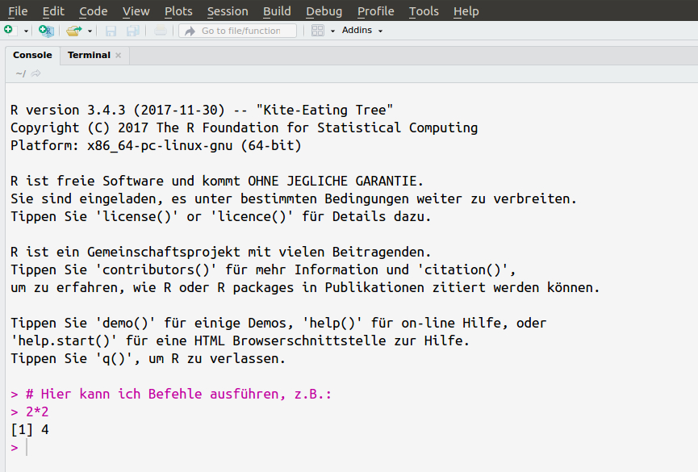

---
output:
  bookdown::pdf_book:
    keep_tex: no
    pandoc_args: [
      "-fmarkdown-implicit_figures"
    ]
    toc: true
    toc_depth: 2
    base_format: tint::tintBook
    number_sections: true
    includes:
      before_body: "00_Lizenz.tex"

header-includes:
  - \usepackage{dsfont}
  - \usepackage{upgreek}
  - \usepackage{soul}
  - \usepackage[german]{babel}

title:  |
    | Testtheorie mit R
subtitle: ''
author: |
    | Martin Papenberg
shortauthor: ""
institute: |
 | Heinrich-Heine-Universität Düsseldorf
 | Institut für Experimentelle Psychologie

bibliography: referenzen.bib
csl: "../apa.csl"
fontsize: 12pt

---

```{r evalAll, echo = FALSE, message = FALSE, warning= FALSE}

library("knitr")
library("tufte")
opts_chunk$set(message=FALSE, warning=FALSE, comment = "",
               fig.align = "center",
               fig.cap="")


## Some functions to manage footnotes, table and figure references
init_footnotes <- function() {
    fnc_counter <<- 0
}

init_refs <- function() {
    fnt_counter <<- 0
}

incfnc <- function() {
    fnc_counter <<- fnc_counter + 1
    return(fnc_counter)
}

incref <- function() {
    fnt_counter <<- fnt_counter + 1
    return(fnt_counter)
}

init_footnotes()
init_refs()

```

\clearpage

# Einstieg

Dieses Skript bietet einen Einstieg in die statistische
Programmiersprache `R`. Es wurde als Begleitmaterial für eine
ein-semestrige Lehrveranstaltung im Master-Studiengang Psychologie an
der Heinrich-Heine-Universität Düsseldorf entworfen. Im Seminar wird
kein Vorwissen über `R` vorausgesetzt. Ich habe das Skript öffentlich
gemacht in der Hoffnung, dass es auch für andere `R`-Einsteiger nützlich
sein kann. Es wird stetig aktualisiert; der aktuelle Stand ist jeweils
der zweiten Seite zu entnehmen.

`R` kann -- unter anderem -- als eine Alternative zur kommerziellen
Statistik-Software IBM-SPSS verwendet werden. Anders als SPSS ist `R`
*frei*, d.h. wir können es gratis aus dem Internet runterladen, auf
beliebig vielen Computern installieren, und unsere Analysen mit jeder
anderen Person teilen, da niemand eine Lizenz zur Nutzung benötigt. Da
`R` mithilfe von *Paketen* beliebig erweitert werden kann, stehen neue
statistische Verfahren häufig schnell zur Verfügung (etwa *Bayesianische
Statistik*). Die Nutzung von `R` ist in den letzten Jahren stark
angestiegen.[^`r incref()`] Auch in der psychologischen Forschung wird
`R` immer mehr zum Standard.[^`r incref()`]

[^`r incfnc()`]:
https://stackoverflow.blog/2017/10/10/impressive-growth-r/

[^`r incfnc()`]:
https://www.psychologicalscience.org/observer/why-you-should-become-a-user-a-brief-introduction-to-r

Wir lernen die Nutzung von `R` anhand von Beispielen der psychologischen
Diagnostik beziehungsweise der Testtheorie kennen. Dabei werden auch echte
Datensätze verwendet, beispielsweise ein Datensatz zum *Narcissistic
Personality Inventory*, der online frei verfügbar ist über das “Open
Source Psychometrics Project”
([https://openpsychometrics.org/](https://openpsychometrics.org/)).

## Über dieses Skript

Dieses Skript wurde als Begleitmaterial für eine Lehrveranstaltung
konzipiert. Das Seminar selbst hat einen starken praktischen Anteil; in
jeder Stunde werden Übungsaufgaben in `R` bearbeitet.[^`r incref()`] Das
Skript bietet den theoretischen Unterbau zu den Übungen. Es wird
empfohlen, das Skript parallel zu den Seminarstunden zu lesen.

[^`r incfnc()`]: Die Übungen des Seminars aus dem Sommersemester 2018
und die zur Bearbeitung nötigen Daten -- wie auch der jeweils aktuelle
Stand dieses Skripts -- können unter
[https://osf.io/y4a6k/](https://osf.io/y4a6k/) abgerufen werden.

Wenn man davor steht, `R` zu lernen, sollte man sich klar machen, dass
die reine Aufarbeitung einer oder mehrerer schriftlicher Lektüren nicht
ausreichend ist. Die praktische Anwendung -- das Ausprobieren und
"Rumspielen" -- sollte einen mindestens genau so großen Anteil
haben. Erst durch die Fehler, die man beim praktischen Arbeiten macht --
und die macht man immer --, lassen sich die eigenen `R`-Fertigkeiten
weiterentwickeln.

Insgesamt gilt: Das Skript und die Übungen stellen nur eine kleine
Auswahl dessen vor, was `R` bietet. Notwendigerweise werden Inhalte
ausgelassen. Bei der Darstellung wird vor allem Wert auf die inhaltliche
Sinnhaftigkeit und Verständlichkeit gelegt; dafür kann es vorkommen,
dass -- wenn angemessen -- Kompromisse bei der technischen Genauigkeit
eingegangen werden.[^`r incref()`] Für so gut wie jede allgemeine Regel
gibt es Spezialfälle, die eine Ausnahme bilden. Auf solche Spezialfälle
werde ich bei der Beschreibung allgemeiner Grundsätze der
Programmiersprache `R` nicht immer Rücksicht nehmen.  Das Skript ist so
ausgelegt, dass ein Grundstein an Kenntnissen gelegt wird, jedoch
erfordert die Meisterung von `R` noch weitere eigenständige Einarbeitung.

[^`r incfnc()`]: Kapitel 2 enthält beispielsweise eine Beschreibung
verschiedener Datentypen in `R` (Zahlen, Text, etc.). Diese Liste deckt
zwar die für uns wichtigsten Datentypen ab, ist aber nicht
vollständig. Aus inhaltlichen Gründen folgt sie außerdem nicht der
internen "technischen" Kategorisierung von Daten in `R`.

### Feedback und Fehlermeldungen

Für Feedback und eine Rückmeldung bei der Entdeckung von Fehlern im
Skript (auch und insbesondere bei der Entdeckung einfacher
Rechtschreibfehler, doppelter oder fehlender Wörter, fehlender Kommas,
etc.) bin ich sehr dankbar! Meldungen können mir an
\href{mailto:martin.papenberg@hhu.de}{martin.papenberg@hhu.de} gesendet
werden.

### Credit

Zur Erstellung des Skripts wurden `R` [3.4.4, @R-base] und die
`R`-Pakete *bookdown* [0.5, @R-bookdown], *knitr* [1.18, @R-knitr],
*rmarkdown* [1.8, @R-rmarkdown], *tufte* [0.2, @R-tufte] und
*tint* [0.1.0, @R-tint] genutzt.

Ich danke Juliane Tkotz für ihr nützliches Feedback zum Skript. Hanna
Siegers, Marlene Wettstein und Frank Calio danke ich ebenfalls für ihre
Fehlersichtungen.

## Erste Schritte mit `R`

Im Seminar nutzen wir die "integrierte Entwicklungsumgebung" (engl:
integrated developement environment; *IDE*) RStudio, um mit `R` zu
arbeiten. Zum Nachvollziehen des Skripts und der Übungen solltet ihr
deswegen RStudio auf eurem eigenen Rechner / Laptop
installieren.[^`r incref()`] Das geht über diesen Link:

[^`r incfnc()`]: Falls ihr eine andere Umgebung benutzt, ist das
natürlich auch kein Problem. Ich selber benutze sogar nur selten
RStudio. Alternativen sind beispielsweise rkward
([https://rkward.kde.org/](https://rkward.kde.org/)) oder emacs ESS
([https://ess.r-project.org/](https://ess.r-project.org/)).

[https://www.rstudio.com/products/rstudio/download/#download](https://www.rstudio.com/products/rstudio/download/#download)

Vermutlich wollt ihr eine Installationsdatei für Windows herunterladen,
es gibt aber auch Optionen für Linux und Mac.  Dafür schaut ihr unter
"Installers for Supported Platforms" beispielsweise unter "RStudio
1.1.442 - Windows Vista/7/8/10".

**Wichtig:** RStudio ist nur die `R`-Umgebung, die wir nutzen, aber
nicht die Programmiersprache `R` selbst. `R` muss noch einmal unter
[https://cran.r-project.org/](https://cran.r-project.org/) gesondert
heruntergeladen werden.

Hier könnt ihr beispielsweise über "Download R for Windows" $\to$
"install R for the first time" gehen.

### Die `R`-Konsole

Wenn wir `R` und RStudio installiert haben, können wir unsere ersten
Schritte mit `R` nehmen. Dafür geben wir **`R`-Code** in die sogenannte
Konsole ein. Im Normalfall finden wir in RStudio die Konsole in der
Anzeige auf der linken Seite (je nachdem, wie ihr RStudio geöffnet habt,
befindet sich die Konsole auch links unten). Wir erkennen die Konsole
daran, dass die Zeile, in die wir unsere `R`-Befehle eintragen, mit
einem `>` beginnt. Um den ersten `R`-Befehl auszuführen, schreiben wir
Folgendes in die Konsole und drücken `Enter`:

```{marginfigure}
 So sieht die `R`-Konsole in RStudio aus.
```

```R

> "Hallo Welt!"

```

Wenn folgende Ausgabe erscheint, hat die Installation funktioniert:

```{r, echo = FALSE}
"Hallo Welt!"
```

Wir können die Arbeit mit `R` beziehungsweise der `R`-Konsole als
Kommunikation verstehen: Wir teilen `R` etwas mit, und `R` gibt uns dazu
passend etwas zurück -- **wenn unsere Anfrage ein *syntaktisch*
korrekter `R`-Befehl war**. Andernfalls gibt `R` eine Fehlermeldung aus.
Zum Beispiel können wir die `R`-Konsole als Taschenrechner
benutzen:

```{r}

1 + 3

3 - 17

3 * 2

3^2

3^2 + 4^2

10 / 5

## Auf Klammerung achten:
(3 + 5) / 2

3 + 5 / 2

```

### Der Skript-Editor

Zumeist werden wir `R`-Code nicht nur in der Konsole schreiben und
ausführen. Wenn wir einen Befehl in der Konsole geschrieben und mit
`Enter` ausgeführt haben, ist er ja quasi verschwunden.[^`r incref()`]
Um Analysen übersichtlich, nachvollziehbar und reproduzierbar zu
gestalten, speichern wir unseren Code in sogenannten Quellcode-Dateien
ab. Dafür gibt es in RStudio (und auch in anderen `R`-Umgebungen) einen
Texteditor. Wir können eine neue Quellcode-Datei unter "Datei $\to$ Neue
Datei $\to$ R Skript" öffnen. Darin können wir unseren R-Code schreiben
und permanent auf unserem Computer abspeichern (und ggf. mit anderen
Personen teilen). Textdateien, die R-Code enthalten, speichern wir mit
der Dateiendung ".r" oder ".R" ab.

[^`r incfnc()`]: Praktisch: Wenn ich mich in der Konsole befinde, kann
ich mit den Pfeil-Tasten (vor allem wichtig: Pfeil-nach-oben) auf meine
letzten Befehle wieder zugreifen. Probiert es aus.

Das Praktische: Wenn wir Code im Editor schreiben, können wir ihn auch
direkt von dort ausführen; wir müssen ihn nicht noch einmal in die
Konsole "copy-pasten". Das funktioniert so: Wenn sich mein Cursor in
einer Zeile befindet und ich `STRG-Enter` drücke, wird der Code in
dieser Zeile ausgeführt. Wenn ich einen Code-Abschnitt markiere, kann
ich ebenso mit `STRG-Enter` genau diesen Abschnitt ausführen. Der Code
wird in diesen Fällen an die Konsole gesendet, die dann die Ausführung
des Codes für uns übernimmt.

### Kommentare

Wenn ein `#`-Symbol in die Konsole oder den Skript-Editor geschrieben
wird, wird der Rest dessen, was in dieser Zeile steht, nicht mehr
interpretiert, d.h.: nicht als R-Code ausgeführt. Beispiel:

```R

# 5 + 5
# nichts ist passiert - `R` gibt mir nicht 10 aus

```

Man nutzt `#`, um Code zu "kommentieren", das heißt um zu erklären und
zu dokumentieren, was der geschriebene Code macht. Diese Kommentare fügt
man in den Quelldateien ein, in denen man die eigenen Analysen
abspeichert. Dieses Skript enthält viel `R`-Code,[^`r incref()`] den ich
stets kommentiere. (Ich habe die Angewohnheit, ein doppeltes `##` am
Anfang einer Zeile zu benutzen, aber das hat keinerlei Bedeutung.)
Gewöhnt euch ebenfalls an, **immer** euren eigenen Code zu
kommentieren. Das gilt sowohl für "richtige" Projekte als auch für
Übungsaufgaben. Das Kommentieren von Code ist vor allem nützlich, um
anderen Personen euren Code zugänglich und verständlich zu machen. Im
häufigsten Fall seid ihr selbst in zwei Wochen diese "andere" Person.

[^`r incfnc()`]: Codeblöcke im Skript bestehen immer aus dem
eigentlichen Code (dieser ist leicht grau hinterlegt) und der *Ausgabe*,
die bei Eingabe des Codes auch so in der `R`-Konsole erscheinen
würde. Den Code könnt ihr auch selbst per Copy & Paste nachvollziehen
(was ich auch empfehle). Die Ausgabe des Codes erkennt ihr meistens
daran, dass sie mit `[1]` startet; so wird in der `R`-Konsole das erste
Element der Ausgabe eines Vektors gekennzeichnet (siehe Kapitel 2).

## Ausblick

In den nächsten zwei Kapiteln beschäftigen wir uns zunächst damit, wie
`R` Daten darstellt. Dabei betrachten wir zunächst die grundlegenste
Datenstruktur, den *Vektor* ([Kapitel 2](#vektoren)). Danach lernen wir
`data.frames` kennen ([Kapitel 3](#dataframes)), die in `R`
Datentabellen darstellen, wie wir sie auch aus Excel oder SPSS kennen.
In [Kapitel 4](#psychometrie) werden wir *psychometrische
Datenauswertungen* durchführen und dabei das Wissen anwenden, das wir
zuvor erworben haben. In Kapitel 5 und 6 lernen wir mit *Funktionen* und
*Schleifen* wichtige allgemeine Elemente von Programmiersprachen kennen
und sehen, wie man mit diesen Elementen in `R` umgehen kann.

```{r child = '02_Vektoren.Rmd'}
```

```{r child = '03_Dataframes.Rmd'}
```

```{r child = '04_Psychometrische_Daten.Rmd'}
```

```{r child = '05_Funktionen.Rmd'}
```

```{r child = '06_Schleifen.Rmd'}
```

```{r child = '07_Simulationen.Rmd'}
```

```{r child = '101_Anhang.Rmd'}
```
