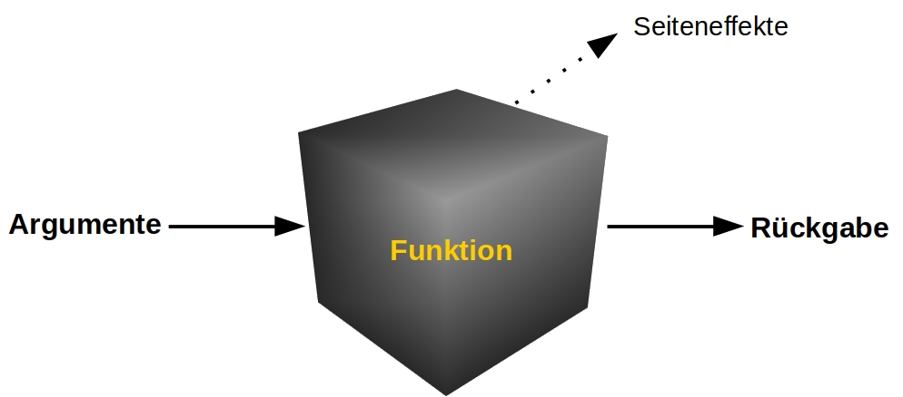

# Funktionen {#funktionen}

Funktionen sind das Herz der `R`-Maschinerie. Jegliche Befehle, die wir 
in `R` durchführen, sind als Funktionen 
umgesetzt.[^everythingisafunction] Wir haben bereits ausgiebig von 
Funktionen Gebrauch gemacht. Wir haben beispielsweise mit `subset()` 
Daten ausgewählt, mit `table()` und `tapply()` deskriptive Statistiken 
angefordert, und mit `cor()`, `colMeans()` und `psychometric::alpha()` 
psychometrische Berechnungen durchgeführt. Dabei haben wir bereits 
einige Eigenschaften von Funktionen zur Kenntnis genommen, etwa dass sie 
Namen haben,[^anonym] Argumente annehmen und ihre Rückgabewerte in 
Variablen gespeichert werden können. In diesem Kapitel soll nun ein 
tiefgründigerer Blick auf Funktionen in `R` gelegt werden. Am Ende des 
Kapitels lernen wir, unsere eigenen Funktionen zu schreiben.

[^everythingisafunction]: Technisch gesehen sind sogar einfache
Berechnungen wie die Addition oder die Auswahl von Elementen per `[·]`
Funktionen. Wir betrachten hier jedoch Funktionen, die dem Schema
`Funktionsname(Argument1, Argument2, ...)` folgen.

[^anonym]: Interessanterweise können Funktionen sogar anonym sein,
also keinen Namen haben. Aber dieser Spezialfall ist für uns erst einmal
nicht von Interesse.

## Das Black-Box-Modell

Diese Grafik zeigt schematisch die Arbeitsweise von `R`-Funktionen:



Funktionen nehmen Argumente an, die ihr Verhalten steuern. Sie geben
genau ein `R`-Objekt zurück, das Rückgabewert genannt wird. Wenn der
Aufruf einer Funktion außer dieser Rückgabe weitere Auswirkung auf die
„Umgebung“ hat, nennt man das einen Seiteneffekt. Als `R`-Neuling ist
es manchmal wichtig zu verstehen, was der Unterschied zwischen den
Seiteneffekten und der Rückgabe einer Funktion ist.

Die innere Arbeitsweise von Funktionen wird als „Black Box“ betrachtet.
Wir wissen nicht unbedingt, wie eine Funktion intern funktioniert, was
uns aber auch nicht interessiert. So lange uns `mean()` den korrekten
Mittelwert ausgibt, ist uns egal, wie `mean()` den Mittelwert
berechnet.[^nichtimmerblackbox] Bei Funktionen interessiert uns in
erster Linie, welche Daten wir einer Funktion als Argumente übergeben
müssen und was sie uns dafür in Austausch zurückgeben. Die folgenden
Abschnitte befassen sich mit den einzelnen Bestandteilen des
„Black-Box-Modells“.

[^nichtimmerblackbox]: Das ist natürlich zunächst einmal anders, wenn wir
selbst neue Funktionen schreiben. Aber auch dann gilt: Wenn ich die
Funktion geschrieben habe und der Berechnung vertraue, kann ich später
auf sie zugreifen, ohne mir jedes Mal über die interne Funktionsweise
Gedanken zu machen. Das kann eine enorme Arbeitserleichterung sein.

##  Argumente

Argumente determinieren das Verhalten von Funktionen. Im einfachsten
Fall bedeutet das, dass die Elemente eines Vektors, den wir `mean()`
übergeben, den ausgegebenen Mittelwert determinieren. Wenn wir gar
keinen Vektor übergeben, erhalten wir kein Ergebnis, sondern eine
Fehlermeldung:

```R
mean()
Fehler in mean.default() : Argument "x" fehlt (ohne Standardwert)
```

Um zu verstehen, wie man mit Argumenten das Verhalten von Funktionen
beeinflusst, ist ein Verständnis der folgenden Punkte wichtig:
[^rueckblicksubset]

[^rueckblicksubset]: Teilweise wurden diese Punkte schon in [Kapitel 3
im Abschnitt zur Funktion `subset`](#subset) angesprochen.

1. Manche Argumente haben Standardwerte (Englisch: „default values“),
die angenommen werden, wenn wir diese Argumente beim Aufrufen der
Funktion nicht explizit angeben. Diese Argumente heißen *optionale
Argumente*.
2. Wenn Argumente keinen Standardwert haben, **müssen** wir dem Argument
   einen Wert übergeben, da die Funktion sonst eine Fehlermeldung und
   kein Ergebnis ausgibt.[^wiedervereinfachung]
3. Argumente haben Namen, die wir verwenden können, um sie in der Form
   `Argumentname = Wert` zu adressieren.
4. Wenn wir für ein Argument nicht explizit den Namen angeben, wird das
   Argument nach seiner Position in der Liste aller angegeben Argumente
   identifiziert.
5. Mit der `R`-Hilfe können wir herausfinden, welche Argumente
   Funktionen annehmen, wie diese heißen, und welche davon optional oder
   verpflichtend sind.


[^wiedervereinfachung]: Das ist streng genommen auch wieder eine
Vereinfachung. Aber für uns reicht dieses Konzept: Hat ein Argument
einen Standardwert, ist es optional; hat ein Argument keinen
Standardwert, ist es verpflichtend.

Wir werden diese Punkte nun exemplarisch anhand der Funktion `mean()`
nachvollziehen. Wir wissen bereits, dass `mean()` mindestens zwei
Argumente annimmt. Beide Argumente haben Namen:

- `x`: der numerische oder logische Vektor, für den der Mittelwert
   bestimmt werden soll. Oftmals wird in `R` das „Datenargument“ (das 
zumeist das erste Argument ist) generisch mit `x` benannt.
- `na.rm`: ein ein-elementiger logischer Vektor, der angibt, ob
`NA`-Werte von der Berechnung ausgeschlossen werden sollen

Da der Aufruf `mean()` ohne Angabe eines numerischen oder logischen
Vektors einen Fehler ergibt, ist uns klar, dass `x` kein optionales
Argument ist. Wir **müssen** einen Vektor übergeben, für den wir einen
Mittelwert bestimmen können. Wieso `mean()` auch sonst aufrufen?

Auf der anderen Seite wissen wir auch, dass wir das Argument `na.rm`
nicht unbedingt angeben müssen -- das würden wir normalerweise nur dann
machen, wenn wir wissen, dass unsere Daten fehlende Werte
enthalten. Folgender Aufruf funktioniert nämlich, ohne dass wir dem
Argument `na.rm` einen Wert übergeben:

```{r}
mean(1:10)
```

Doch was passiert mit `na.rm`, wenn wir es nicht explizit angeben?
Hierbei nehmen wir folgende Regel zur Kenntnis: **Optionale Argumente
sind deswegen optional, da ihnen von der Funktion ein Wert zugewiesen
wird, wenn wir das Argument nicht selbst übergeben**. Das Argument
`na.rm` hat den Standardwert `FALSE`, weswegen `NA`-Werte im
Normalfall nicht von der Berechnung ausgeschlossen werden. Stattdessen
wird uns `NA` zurückgegeben, wenn `x` mindestens einen fehlenden Wert
enthält. Folgende Aufrufe sind demnach äquivalent:

```R
mean(1:10)
mean(1:10, na.rm = FALSE)
```

Da wir nicht immer alle optionalen Argumente von Funktionen angeben
wollen -- stattdessen „vertrauen“ wir auf die Standardwerte --,
ist es sehr hilfreich, dass wir Funktionsargumente per Namen ansprechen
können. So können wir nur genau die optionalen Argumente auswählen,
die wir anpassen wollen; für die anderen belassen wir den Standardwert.

Interessanterweise wissen wir bislang gar nicht, ob wir das Argument
`na.rm` tatsächlich mit Namen ansteuern müssen. In Funktionen können wir
Argumente ja anhand ihres Namens *oder* ihrer Position ansprechen. Wenn
`na.rm` das zweite Argument wäre, könnten wir auch folgenden Aufruf
verwenden:

```R
mean(c(1, 2, 3, NA), TRUE)
Fehler in mean.default(c(1, 2, 3, NA), TRUE) :
  'trim' must be numeric of length one
```

Das hat aber nicht funktioniert. Diese Fehlermeldung informiert uns
darüber, dass `mean` an der zweiten Position ein Argument mit dem Namen
„`trim`“ erwartet. Offensichtlich hat `mean` mit `trim` noch ein
weiteres optionales Argument, das wir bislang gar nicht kannten.  Das
heißt für uns: Solange wir für `trim` -- was auch immer das ist --
keinen Wert angeben, müssen wir `na.rm` per Namen ansprechen.

Wenn wir Argumente mit Namen ansteuern, brauchen wir uns über die
Reihenfolge der Argumente keine Gedanken machen. Das ist oftmals sehr
hilfreich. Deswegen funktioniert folgender Aufruf:

```{r}
mean(na.rm = FALSE, x = 1:10)
```

Wir erweitern nun das Beispiel von oben unter Berücksichtigung unseres
Wissens über die Vergabe von Namen bei Funktionsargumenten. Folgende
Aufrufe sind alle äquivalent:

```R
mean(1:10)
mean(1:10, na.rm = FALSE)
mean(x = 1:10)
mean(x = 1:10, na.rm = FALSE)
mean(na.rm = FALSE, x = 1:10)
```

Nicht äquivalent zu den obigen Aufrufen sind jedoch folgende Befehle,
die zu Fehlermeldungen führen, da `na.rm` nicht das zweite Argument von
`mean()` ist:


```R
mean(1:10, FALSE)
mean(x = 1:10, FALSE)
```

Wir haben nun gelernt, wie wir Argumente an Funktionen übergeben
können. Dieses Wissen hilft uns jedoch nur, wenn wir folgende Frage
beantworten können:

**Wie finden wir heraus, welche Argumente eine Funktion annimmt?**

### Die `R`-Hilfe{#help}

In `R` sind bereits sehr viele statistische und testtheoretische
Analysen als Funktionen verfügbar. Wenn diese Funktionen noch nicht in
der Basisversion von `R` enthalten sind, sind sie stattdessen häufig in
externen Paketen verfügbar. So können wir beispielsweise ANOVAs,
explorative oder konfirmatorische Faktorenanalysen und viele andere
Auswertungen durchführen -- wenn wir denn wollen. Wir benötigen dabei
nur das folgende Wissen:

1. Welche Funktion führt die gewünschte Berechnung aus?
2. Wie können wir diese Funktionen bedienen?

Wir beschäftigen uns im Folgenden mit dem zweiten Punkt.[^einschub]
Wir lernen, wie wir uns mit der `R`-Hilfe einen Überblick über die
Arbeitsweise von Funktionen verschaffen können. Probieren wir es
exemplarisch für die Funktion `mean()` aus:

[^einschub]: Auch wenn es häufig erst einmal der Knackpunkt ist zu
wissen, ob es schon eine Funktion gibt, die das eigene Problem löst, wie
diese heißt und in welchem Paket ich sie finde.

```R
?mean
```

Interessant ist für uns erst einmal der obere Abschnitt „Usage“:

```R
Usage:

    mean(x, ...)

    ## Default S3 method:
    mean(x, trim = 0, na.rm = FALSE, ...)
```

Wir ignorieren an dieser Stelle, dass uns zwei Varianten angeboten
werden, die Funktion `mean()` zu nutzen.[^ueberladung] Wenn in der Hilfe
eine „Default S3 method“ angeboten wird, interessiert uns oftmals diese;
so ist es auch hier der Fall. An dieser Stelle finden wir die
Informationen, die wir benötigen, um die Funktion zu nutzen. Wir sehen

[^ueberladung]: Viele Funktionen können auf verschiedene Arten
aufgerufen werden. Das heißt: Sie können mit unterschiedlichen
`R`-Objekten als Eingabe genutzt werden.

- die Namen der Argumente
- die Reihenfolge der Argumente
- welche Argumente optional sind
- was die Standardwerte der optionalen Argumente sind

Die Standardwerte der optionalen Argumente lassen sich dadurch ablesen,
dass in der Argumentliste in der Form `Argumentname = Wert` schon ein
Wert angegeben ist. Das Argument `trim` etwa hat den Standardwert
`0`. Wie wir bereits wissen, hat das Argument `na.rm` den
Standardwert `FALSE`. Bei nicht-optionalen Argumenten ist kein
Standardwert, sondern nur der Name des Arguments angegeben.

Wenn wir mehr über die Argumente erfahren wollen, müssen wir den
Abschnitt „Arguments“ der `R`-Hilfe konsultieren. Folgende Punkte
interessieren uns bei der Beschreibung:

1. Was ist die inhaltliche Bedeutung eines Arguments?
2. Was für ein `R`-Objekt muss ich übergeben, um ein Argument
anzusteuern? (Z.B. einen Vektor, einen `data.frame`, eine `matrix`,
eine `list` oder sogar eine Funktion -- siehe [Kapitel 3: Funktion
tapply](#tapply))

Die Beschreibung der Argumente achtet sehr auf Prägnanz und technische
Korrektheit, wie wir am Beispiel der Beschreibung der Argumente der
Funktion `mean` erkennen können:

```R
Arguments:

    x: An R object.  Currently there are methods for
       numeric/logical vectors and date, date-time and
       time interval objects. Complex vectors are allowed
       for ‘trim = 0’, only.

    trim: the fraction (0 to 0.5) of observations to
       be trimmed from each end of ‘x’ before the mean
       is computed.  Values of trim outside that range
       are taken as the nearest endpoint.

    na.rm: a logical value indicating whether ‘NA’ values
       should be stripped before the computation proceeds.
```

Die `R`-Hilfe ist also hilfreich, aber nicht immer ganz leicht zu
nutzen. Oftmals ist eine weitere Google-Recherche oder das Nachfragen
bei einer Freundin oder einem Freund sinnvoll, wenn man die Nutzung
einer Funktion meistern will. 

Mehr Hilfe zur Nutzung einer Funktion finden wir im Abschnitt „Examples“
der `R`-Hilfe. Hier können wir am konkreten Beispiel betrachten, wie die 
Funktion angewendet werden kann. Wenn wir Glück haben, ist genau das 
dabei, was wir brauchen. Der Code ist dabei so gewählt, dass man ihn per 
Copy & Paste einfach selbst in der Konsole ausführen kann. Bei `mean()` 
finden wir etwa den folgenden Beispiel-Code:

```R
Examples:
     x <- c(0:10, 50)
     xm <- mean(x)
     c(xm, mean(x, trim = 0.10))
```

```{block, type = "block"}
**Hinweis:** Wenn die `R`-Hilfe nicht so hilfreich ist, schaut euch 
die Beispiele an.
```

### Namenlose Argumente

In der Einführung in die Arbeitsweise von Funktionsargumenten habe ich
behauptet, dass Argumente Namen haben. Wie fast jede allgemeine Regel
hat auch diese Regel Ausnahmen -- Argumente haben nämlich gar nicht
immer einen Namen. Das ist für uns zwar nicht ganz so wichtig, aber wir
können es hier zur Kenntnis nehmen. Wir haben sogar schon mit Funktionen
gearbeitet, die namenlose Argumente annehmen können. Das ist
beispielsweise immer dann notwendig, wenn Funktionen eine beliebige
Anzahl von Argumenten annehmen. Die Funktion `c` nimmt beliebig viele
Vektoren entgegen, die dann zu einem Vektor zusammengefügt werden. Auch
andere Funktionen wie `table()` -- die beliebig viele Vektoren zur
Erstellung von Kreuztabellen annimmt -- und `dplyr::arrange()` -- die
beliebig viele Kriterien zur Sortierung eines `data.frames` annimmt --
haben unbenannte Argumente. In der `R`-Hilfe ist dies oftmals an dem
Platzhalterargument „`...`“ (lies: *ellipsis*) zu erkennen, siehe:
[^komischeargumente]

[^komischeargumente]: Wir nehmen interessiert zur Kenntnis, dass `c()`
zwei Argumente mit Standardwerten hat: `recursive` und `use.names`. Mit
diesen Argumenten haben wir uns bislang nicht beschäftigt und das werden
wir auch weiterhin nicht tun. Oftmals „vertraut“ man den Standardwerten,
wobei man damit früher oder später auch mal auf die Nase fallen wird.

```R
?c

Usage:

     ## S3 Generic function
     c(...)

     ## Default S3 method:
     c(..., recursive = FALSE, use.names = TRUE)

Arguments:

     ...: objects to be concatenated.
```

## Rückgabewerte

Der Rückgabewert einer Funktion ist das `R`-Objekt, das die Funktion
ausgibt. Jede Funktion hat einen Rückgabewert.  Die Funktion `mean()`
gibt beispielsweise einen ein-elementigen Vektor aus, der das
arithmetische Mittel des Eingabevektors repräsentiert. Die Funktion
`subset()` gibt immer einen `data.frame` aus -- wie der aussieht,
bestimmen die Argumente, die wir der Funktion übergeben.

Das Verständnis von Rückgabewerten führt uns etwas tiefer in die 
Innereien der `R`-Programmiersprache. Betrachten wir im folgenden 
Beispiel die Funktion `t.test()`, die einen *t*-Test durchführt und 
dabei die Mittelwerte zweier Vektoren vergleicht. Ich verwende den 
NPI-Datensatz aus Kapitel 5 und vergleiche den mittleren 
Narzissmus-Gesamtwert (Spalte `score`) zwischen weiblichen und 
männlichen Testnehmenden (Spalte `gender`; Kodierung: männlich = 1, 
weiblich = 2).[^vektorgrundlagen]

[^vektorgrundlagen]: An dieser Stelle ist es sinnvoll, noch einmal zu
rekapitulieren, wie hier die Narzissmuswerte der Männer und Frauen
ausgewählt werden.

```R
t.test(
  npi$score[npi$gender == 1],
  npi$score[npi$gender == 2]
)
```

Wir erhalten folgende Ausgabe in der Konsole:

```{r, echo = FALSE}
t.test(npi$score[npi$gender == 1], npi$score[npi$gender == 2])
```

Hier werden uns alle relevanten Aspekte der *t*-Test-Berechnung
ausgegeben. Ein erster interessanter Hinweis ist, dass kein klassischer
*t*-Test, sondern ein „Welch Two Sample t-test“ gerechnet wurde.
[^welch] Weiterhin werden uns t-Wert, Freiheitsgrade, p-Wert
(„`p-value < 2.2e-16`“ bedeutet, dass der p-Wert so klein ist, dass vor
dem ersten Wert hinter dem Komma, der **nicht** Null ist, mindestens 16
Nullen stehen), das 95%-Konfidenzintervall der Differenz der mittleren
Werte, sowie die Mittelwerte selbst ausgegeben. Insgesamt kann man
interpretieren, dass Männer im Mittel signifikant höhere Narzissmuswerte
aufweisen als Frauen. Aber dieser Befund ist für uns in diesem Fall
uninteressant -- wir wollen uns ja mit dem Rückgabewert befassen. Was
für ein `R`-Objekt wurde uns denn ausgegeben?

[^welch]: Setzt man das Argument `var.equal` auf `TRUE`, wird ein
klassischer t-Test gerechnet (Standardwert: `FALSE`). Es ist etwas
ironisch, dass die Funktion `t.test()` keinen klassischen t-Test rechnet.
Wenn man das erwartet, könnte man an dieser Stelle auf die Nase fallen,
wenn man einfach auf die Standardwerte der Funktion vertraut. Mehr
Informationen zum Welch-t-Test finden sich hier:
[https://en.wikipedia.org/wiki/Welch%27s_t-test](https://en.wikipedia.org/wiki/Welch%27s_t-test).

Was in der Konsole angezeigt wird, stellt nicht direkt das `R`-Objekt
dar, das die Funktion `t.test()` ausgibt. Es handelt sich hierbei um eine
etwas lesefreundlichere Zusammenfassung des Tests. Um das tatsächlich
ausgegebene Objekt zu inspizieren, kann ich die Funktion `str()`
verwenden. Dazu speichere ich die Ausgabe des t-Tests zunächst in einer
Variablen ab:

```R
test <- t.test(
  npi$score[npi$gender == 1],
  npi$score[npi$gender == 2]
)
str(test)
```

```{r, echo = FALSE}
test <- t.test(npi$score[npi$gender == 1], npi$score[npi$gender == 2])
str(test)
```

Das von `t.test()` ausgegebene Objekt ist eine „List of 9“, also eine
Liste mit 9 Einträgen. Listen sind sehr allgemeine Datencontainer, die
Elemente von beliebigem Typ und beliebiger Anzahl beinhalten können.
[^Rekursiv] Listen stellen eine wichtige Datenstruktur in `R` dar --
vielleicht ist es sogar die wichtigste Datenstruktur, da `data.frames`
spezielle Listen sind, in denen jeder Eintrag (d.h., jede Spalte) ein
Vektor gleicher Länge ist. Die Elemente der Liste können benannt sein,
wie es bei der Rückgabe von `t.test()` der Fall ist. In diesem Fall kann
ich, wie wir es von der Spaltenauswahl in `data.frames` kennen, mit der
`$`-Notation auf einzelne Elemente zugreifen:

[^Rekursiv]: Ein Eintrag einer Liste könnte beispielsweise eine
andere Liste sein.

```{r}
test$statistic # t-Wert als ein-elementiger Vektor
test$alternative # ein- oder zweiseitiger Test?
test$parameter # Freiheitsgrade
```

Es ist nicht unüblich, dass komplexere statistische Berechnungen eine
Liste als Ausgabeobjekt ergeben. Listen sind dann sinnvoll, wenn während
der Berechnung mehrere Werte anfallen und es nützlich ist, diese an den
Nutzer zurückzugeben. Im Falle des t-Tests interessieren uns etwa die
Freiheitsgrade, der t-Wert und der p-Wert.

## Seiteneffekte

Jede Funktion hat genau einen Rückgabewert, also genau ein `R`-Objekt,
das von der Funktion zurückgegeben wird. Jegliche Auswirkungen, die eine
Funktion darüber hinaus hat -- außerhalb der inneren Arbeitsweise --,
werden Seiteneffekte genannt. Beispielsweise war die Konsolen-Ausgabe
der Funktion `t.test()` im oberen Fall ein Seiteneffekt. Wenn ich die
Funktion `t.test()` aufrufe, wird mir eine Zusammenfassung des Tests in
der Konsole ausgeben, die als Mensch etwas einfacher zu verarbeiten ist
<!-- als die Liste, die die „tatsächliche“ Rückgabe darstellt. Das Zeichnen -->
von Abbildungen ist auch als Seiteneffekt zu verstehen. Wenn wir
beispielsweise `hist(npi$score)` aufrufen, wird uns ein Histogramm der
Narzissmuswerte des NPI angezeigt. Dieses Histogramm ist ein
Seiteneffekt und nicht die Ausgabe der Funktion `hist()`. Interessierte
sind aufgefordert herausfinden, was deren tatsächliche Rückgabe ist.

Ich werde die Diskussion von Seiteneffekten bei dieser kurzen und
oberflächlichen Einführung belassen. Manchmal ist die Unterscheidung in
Seiteneffekte und Rückgabe sinnvoll; wenn wir etwa die Ergebnisse einer
Funktion weiter verwenden möchten, ist es wichtig zu wissen, welche
Datenstruktur die Funktion ausgibt und wie wir auf die ausgegebenen
Werte zugreifen können. Um Power-Analysen für t-Tests zu simulieren, ist
es beispielsweise nötig, die exakten p-Werte aus der Ausgabe der
Funktion `t.test()` auszulesen. In dem Fall werden wir die Funktion
`t.test()` gegebenenfalls 10,000 Mal aufrufen und können es uns nicht
leisten, den p-Wert jedes Mal aus der Konsolen-Ausgabe abzulesen.
Stattdessen wollen wir den Prozess der p-Wert-Extraktion automatisieren;
und genau für solche Automatisierungen lernen wir das Programmieren.

## Selbst geschriebene Funktionen

Das Schreiben eigener Funktionen sollte früher oder später zum
Repertoire eines `R`-Nutzers gehören. Mit selbst geschriebenen
Funktionen können wir häufig durchgeführte Berechnungen abstrahieren und
beliebig oft durchführen. Betrachten wir den folgenden Code:

```{r, results = "hide"}
(0.23 * 2) / (1 + (2 - 1) * 0.23)
(0.47 * 3) / (1 + (3 - 1) * 0.23) # copy-paste Fehler
(0.68 * 4) / (1 + (4 - 1) * 0.68)
```

Erkennt ihr, was berechnet wird? Falls nicht, betrachtet diesen Code:

```{r, results = "hide"}
spearman_brown(0.23, 2)
spearman_brown(0.37, 3)
spearman_brown(0.68, 4)
```

In der ersten Variante sind nur ein paar Zahlen und arithmetische
Operationen zu sehen, die Semantik der Berechnung ist jedoch vollkommen
unklar. Durch das Copy-Pasten des Codes ist mir sogar ein Fehler
unterlaufen, denn ich habe in der zweiten Zeile einmal vergessen den
Wert 0.23 durch 0.47 auszutauschen -- solche Fehler passieren häufig
und sind sehr schwierig zu entdecken [siehe @li2006]. Durch die Nutzung
der Funktion, die ich in Kapitel 5 definiert habe, ist der Code
lesbarer geworden und einfach interpretierbar: Ich möchte drei
Reliabilitätsschätzer um die Faktoren 2, 3 bzw. 4 korrigieren. Sofern
ich bei der Definition meiner Funktion keinen Fehler gemacht habe, sind
diese Aufrufe auch robuster gegenüber Copy-Paste-Fehlern.

Mit eigenen Funktionen folgen wir dem Programmierer-Credo „*do not
repeat yourself*“. Wenn wir einmal Code zur Lösung eines Problems
geschrieben haben, möchten wir denselben Code nicht noch einmal
schreiben, um ein gleiches bzw. ähnliches Problem zu lösen. Eigene
Funktionen helfen uns effizienter -- man könnte sogar sagen: fauler --
zu arbeiten. Außerdem führen sie zu besser lesbarem Code, denn
Funktionsnamen[^namensindwichtig] kommunizieren die Intention von Code
deutlich besser als das reine Aneinanderreihen von Zahlen, Operatoren
und Variablen.

[^namensindwichtig]: Wie bei Variablen ist auch bei Funktionen eine
sinnvolle Benennung unerlässlich.

### Definition der eigenen Funktion

Erinnern wir uns an die Spearman-Brown-Funktion, die ich in Kapitel 5
definiert habe:

```R
1   spearman_brown <- function(reliability, factor) {
2     numerator  <- reliability * factor
3     denominator <- 1 + (factor-1) * reliability
4     corrected_reliability <- numerator / denominator
5     return(corrected_reliability)
6   }
```

Um die Funktion zu definieren, führe ich diese sechs Zeilen Code einfach 
in der `R`-Konsole aus. In RStudio reicht es sogar, STRG-Enter zu 
drücken, wenn sich mein Cursor in Zeile 1 befindet. In dieser Zeile 
beginnt die Definition der Funktion: Ich erstelle eine Variable, der ich 
mit „`<-`“ eine Funktion zuweise. Die Funktion `spearman_brown()` wird 
also mit der Funktion `function()` erstellt (kein Witz). Die Funktion 
`function()` nimmt die Argumente entgegen, die auch meine neu definierte 
Funktion `spearman_brown()` annehmen soll. Die Parameter, die bei der 
Spearman-Brown-Korrektur eine Rolle spielen, sind der 
Reliabilitätsschätzer und der Korrekturfaktor. Aus diesem Grund werden 
die zwei Argumente `reliability` und `factor` definiert.

Auf die Definition der Argumente folgt der „Körper“ (engl.: *body*) der
Funktion. Der Körper führt die gewünschte Berechnung durch und
verwendet dabei die Funktionsargumente als Variablen.
Funktionsargumente sind also nichts anderes als Variablen, die im
Innern einer Funktion leben. Der Körper der Funktion wird in
geschwungenen Klammern `{·}` eingeschlossen. Solche Klammern bilden
einen abgeschlossenen Block von `R`-Code; sie werden uns auch im
nächsten Kapitel bei der Verwendung von Schleifen wieder begegnen.

In Zeile 5 wird mit der Funktion `return()` angegeben, dass die Variable 
`corrected_reliability` von der Funktion zurückgegeben werden soll. Das 
heißt: das `R`-Objekt, das innerhalb der Funktion in die Variable 
`corrected_reliability` geschrieben wird, ist der Rückgabewert der 
Funktion.

### Lokale Variablen

Werfen wir noch einmal einen Blick auf den Körper der Funktion
`spearman_brown()`. Wir sehen hier bereits gewohnten `R`-Code -- nichts
Besonderes: Variablen werden geschrieben und Berechnungen werden
durchgeführt. Ein wichtiger Punkt an diesen Berechnungen ist jedoch,
dass sie nur innerhalb der Funktion stattfinden und keine Wirkungen
„nach außen“ haben. Was heißt das konkret? Beispielsweise sind alle
Variablen, die innerhalb der Funktion definiert werden, sogenannte
*lokale* Variablen. Im Gegensatz zu den lokalen Variablen stehen globale
Variablen. Global waren alle Variablen, die wir bislang per `<-`
definiert haben. Solche globalen Variablen werden uns in RStudio im
Panel oben rechts unter „Global Environment“ angezeigt.

Lokale Variablen sind außerhalb der Funktion nicht sichtbar und 
verschwinden nach Aufruf der Funktion wieder.[^garstig] Es ist also 
nicht so, dass die Variablen `numerator`, `denominator` und 
`corrected_reliability` in die globale `R`-Umgebung geschrieben werden, 
wenn ich die Funktion `spearman_brown()` aufrufe. Das ist extrem 
nützlich: Ich habe die Variablen `numerator` und `denominator` nur 
definiert, damit mein Code gut lesbar ist und die einzelnen Code-Zeilen 
nicht zu lang werden.[^codestil] Am Ende interessiert mich aber nur der 
Spearman-Brown-Schätzer als Ergebnis der Berechnung; Variablen, die ich 
als Zwischenergebnisse abspeichere, interessieren mich hingegen nicht. 
Wenn ich eine Funktion schreibe, bleiben solche Hilfsvariablen verborgen 
und nur der Rückgabewert dringt nach außen. Ich kann den Rückgabewert 
abfangen, indem ich ihn in einer Variablen abspeichere:

[^garstig]: Umgekehrt gilt hingegen: Innerhalb einer Funktion kann
man auf Variablen der globalen `R`-Umgebung zugreifen. Ignoriert das
jedoch bitte. Werte, mit denen eine Funktion arbeitet, sollten der
Funktion per Argument übergeben werden.

[^codestil]: Es ist guter Stil, die Menge von Code pro Zeile zu
begrenzen. Eine Daumenregel ist die Verwendung von nicht mehr als 80
Zeichen Code pro Zeile. Dafür kann es beispielsweise helfen,
Zwischenberechnungen in Variablen abzuspeichern. Eigene Funktionen
helfen ebenfall dabei, Code lesbar zu gestalten.

```{r}
split_half_correct <- spearman_brown(0.63, 2)
```

Durch diesen Befehl wird eine korrigierte Reliabilität in eine Variable
mit dem Namen `split_half_correct` geschrieben; dass der Rückgabewert
der Funktion innerhalb der Funktion in einer Variablen mit dem Namen
`corrected_reliability` abgespeichert ist, ist für das ausgegebene
Objekt nicht von Bedeutung.

Argumente sind ebenfalls lokale Variablen in der Funktion.  Wenn wir
einer Funktion also ein Argument übergeben, definieren wir damit eine
lokale Variable mit dem Namen des Arguments innerhalb der
Funktion. Daraus können wir beispielsweise schließen, dass im Code der
Funktion `mean()` irgendwo eine Variable mit dem Namen `na.rm`
verwendet wird.

### Optionale Argumente

Bei der Definition einer Funktion können wir Standardwerte vergeben und
somit optionale Argumente definieren. Wenn wir beispielsweise davon
ausgehen, dass wir die Spearman-Brown-Korrektur meistens verwenden, um
eine Split-Half-Korrelation zu korrigieren, könnten wir das Argument
`factor` per default auf 2 setzen. Das funktioniert wie folgt:

```R
spearman_brown <- function(reliability, factor = 2) {
    ...
}
```

Diese Schreibweise kennen wir schon vom Aufruf von Funktionen, wenn wir
die Argumente mit Namen ansprechen. In diesem Fall können wir die
Funktion `spearman_brown()` auch wie folgt äquivalent verwenden:

```R
split_half_correct <- spearman_brown(0.63)
split_half_correct <- spearman_brown(0.63, 2)
```

### Wann schreibe ich meine eigene Funktion

Wie wir in den letzten Abschnitten gesehen haben, ist die technische
Definition einer Funktion keine schwierige Sache. Schwieriger ist
häufiger die Antwort auf die Frage, wann ich tatsächlich eine Funktion
schreiben will. Darauf gibt es keine einzige richtige Antwort, und am
Ende muss jeder für sich selbst entscheiden. Generell ist eine
sinnvolle Daumenregel, dann eine Funktion zu schreiben, wenn man
denselben Code mehrfach geschrieben hat. Häufiges Copy & Paste kann
da ein guter Indikator sein. In dem Fall solltet ihr identifizieren,
welche Details sich jeweils bei den verschiedenen Varianten des Codes
geändert haben, und diese in Argumente umwandeln.

Um zu erkennen, wann Funktionen nützlich sind und welche Variablen man
als Argumente umsetzen will, bedarf es sicherlich einiger Erfahrung mit
`R`. Mein Tipp für Anfänger ist deswegen vor allem: Erst mal einfach
„coden“ -- später Funktionen schreiben. Mit mehr Erfahrung kann sich
diese Vorgehensweise ändern. Ich überlege oftmals schon in der
Planungsphase eines Projekts, welche Funktionen sich sinnvollerweise
anbieten und wie diese zusammen arbeiten sollten. Aber das Vorgehen
hängt auch stark  von der Art des Projekts ab. Wenn ich bloß Daten
einlese und einen t-Test oder eine ANOVA rechne, muss ich dafür keine
Funktion schreiben. Wenn ich hingegen viel mit Daten an sich arbeite --
also oft Daten auswähle, transformiere und aus bestehenden Werten neue
Werte ableite -- ergeben eigene Funktionen oftmals mehr Sinn.

## Fragen zum vertiefenden Verständnis

1. Was ist der Rückgabewert der Funktion `str()`?
2. Was ist der Rückgabewert der Funktion `hist()`?
3. Kann ich mit der Funktion `spearman_brown()` gleichzeitig mehrere
   Reliabilitätsschätzer korrigieren? (Code inspizieren $\to$ überlegen
   $\to$ ausprobieren)
