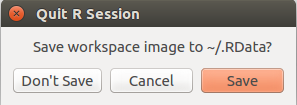

# Anhang

Dieser Abschnitt arbeitet einige Schwierigkeiten auf, die sich in den
praktischen Übungen des Seminars ergeben haben.

## Daten einlesen {#datenEinlesen}

Das Einlesen von Daten in `R` stellt uns vor verschiedene Probleme. Ich
gehe an dieser Stelle auf ein grundlegendes Problem ein, das sich bei
dem Einlesen jeglicher Daten stellt (egal ob man SPSS, Excel, csv, oder
sonstige Dateien einliest): Woher weiß `R`, wo sich die Daten befinden,
die ich einlesen möchte?  Die Festplatte ist groß -- `R` kann nur
wissen, in welchem Ordner Daten liegen, wenn wir es `R` verraten.

Unsere Strategie: Wir verwenden RStudio-Projekte. Beachtet, dass dies
nur eine von verschiedenen Möglichkeiten ist, mit dem "Dateisuchproblem"
umzugehen. Aber es ist eben die, die wir nutzen. **Beachtet ebenfalls,
dass das das Einzige ist, wofür wir RStudio Projekte nutzen: Wir legen
RStudio Projekte an, um `R` mitzuteilen, wo es nach Daten suchen soll.**
Bevor wir ein RStudio Projekt anlegen, müssen wir wissen, wo auf unserem
Computer der Datensatz liegt. Wenn wir das wissen, legen wir in dem
entsprechenden Ordner wie folgt ein Projekt an:

&nbsp;

$\to$ File
$\to$ New project
$\to$ Associate a project with an existing working directory
$\to$ Browse
$\to$ *Zum Ordner navigieren*
$\to$ Open
$\to$ Create Project

&nbsp;

Nach dem Anlegen startet sich RStudio neu und unten rechts im Panel wird
der Inhalt des Projekt-Ordners angezeigt. Wenn wir das Projekt gestartet
haben, können wir Daten einlesen, die in diesem Ordner liegen. Dafür
werden wir Funktionen aufrufen, die den Datensatz mit Dateinamen
ansteuern. Folgender Aufruf etwa könnte eine csv-Datei einlesen und die
Tabelle als `data.frame` in der Variablen `tp` speichern.

```R
tp <- read.csv("technophobie.csv")
```

Wenn wir schon einmal ein Projekt im Ordner mit unseren Daten angelegt
haben, können wir das Projekt beim nächsten Mal wieder aufrufen. Dafür
gehen wir über

&nbsp;

$\to$ Open Project
$\to$ *Zum Ordner navigieren*
$\to$ *Projektdatei auswählen* (hat die Endung .Rproj)
$\to$ *Öffnen*

## Das Environment sauber halten

Wenn wir in `R` arbeiten, ist es wichtig, dass wir einen Überblick über
die Variablen haben, die gerade existieren. Im Folgenden beschreibe ich
ein paar grundlegende Strategien, um unsere `R`-Arbeitsumgebung
einigermaßen sauber zu halten.

### Variablen löschen

RStudio gibt uns in einem Panel oben rechts darüber Auskunft, welche
Variablen sich in unserem sogenannten *Environment* befinden. Darin
kommen alle Variablen vor, die wir irgendwann mit einer Zuweisung
("`<-`") erstellt haben. Um ein bisschen Ordnung zu halten, ist es
nützlich zu wissen, wie man einzelne oder alle Variablen wieder
entfernen kann. Es kann schnell passieren, dass man sehr viele Variablen
erstellt, über die man sonst die Übersicht verliert.

Mit der Funktion `rm` kann man Variablen löschen, etwa:

```R
foo <- 1:10
rm(foo)
```

Möchte man alle Variablen aus dem Environment löschen, kann man den
Befehl `rm(list = ls())` verwenden, etwa:

```R
foo <- 1:10
bar <- 1:100
gaz <- mean(bar)
rm(list = ls()) # löscht alles, nur mit Vorsicht verwenden
```

### Mit einem sauberen Environment starten

Wenn man RStudio beendet, wird einem von RStudio die Frage gestellt, ob
man seinen "workspace" abspeichern will. Das kann etwa so aussehen, bei
euch sieht es gegebenenfalls ein wenig anders aus:



Wenn man in diesem Fall zustimmt, wird im derzeitigen "working
directory" -- für uns heißt das: der Ordner unseres RStudio Projekts --
eine Datei mit dem Namen ".RData" abgelegt. Diese Datei enthält alle
Variablen, die sich derzeit in unserem Environment befinden. Also alle
Variablen, die uns oben rechts im Panel auch angezeigt werden. Wenn wir
zustimmen und das Projekt aus dem Ordner neu laden, werden beim nächsten
Mal alle Variablen unserer Session neu geladen. Ich rate stark davon ab,
so zu arbeiten. Ich würde bevorzugen, **immer**[^entscheidetselbst] mit
einem leeren Environment zu starten. Der einfachste Weg, um dies zu
bewerkstelligen, ist immer "Don't save" auszuwählen, wenn man gefragt
wird. Wenn man aus Versehen mal auf "Save" geklickt hat, kann man das
Environment beim nächsten Start des Projekts mit dem Befehl `rm(list =
ls())` wieder leeren. Auf Dauer hilft dann aber nur, die angelegte Datei
im RStudio Projektordner zu löschen (diese wird vermutlich ".RData"
heißen).

[^entscheidetselbst]: Natürlich gibt es auch hier Ausnahmen. Wenn ihr
selber einen Grund findet, aus dem es für euch doch gut ist, die
Variablen abzuspeichern -- etwa weil das Dateneinlesen sonst sehr lange
dauert --, dann macht bitte das, was für euch sinnvoll ist.

# Referenzen
